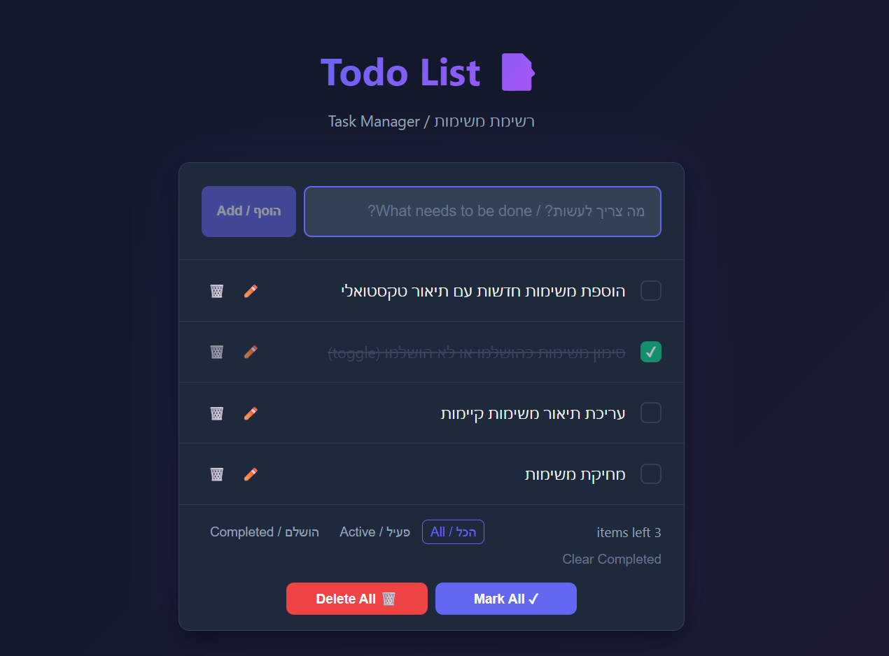

# 📝 Todo List Application

אפליקציית ניהול משימות מודרנית הבנויה עם React 19 ו-Vite, עם תמיכה מלאה ב-RTL לעברית.

## 🚀 הרצת הפרויקט

```bash
# התקנת תלויות
npm install

# הרצה במצב פיתוח
npm run dev
```

האפליקציה תרוץ בכתובת: `http://localhost:8080/`

---

## 🧩 רשימת קומפוננטות

| קומפוננטה | אחריות |
|-----------|---------|
| **App.jsx** | קומפוננטת Container המנהלת את ה-state הגלובלי (tasks, filter), סנכרון עם LocalStorage, וכוללת את כל ה-CRUD handlers. |
| **TaskInput.jsx** | טופס להוספת משימות חדשות עם ולידציה וניקוי אוטומטי של השדה לאחר הוספה. |
| **TaskList.jsx** | מרנדרת את רשימת המשימות (מסוננת) ומציגה הודעה כאשר אין משימות. |
| **TaskItem.jsx** | מציגה משימה בודדת עם יכולות toggle, עריכה inline, ומחיקה. |
| **FilterBar.jsx** | מכילה כפתורי סינון (All/Active/Completed), מונה משימות, וכפתורי "Mark All", "Clear Completed" ו-"Delete All". |

---

## ✨ תכונות

- ✅ הוספה, עריכה, סימון ומחיקת משימות
- ✅ סינון לפי סטטוס (הכל / פעילות / הושלמו)
- ✅ שמירה אוטומטית ב-LocalStorage
- ✅ מונה משימות פעילות
- ✅ סימון כל המשימות כהושלמו (Mark All)
- ✅ מחיקת כל המשימות (Delete All) עם אישור
- ✅ תמיכה מלאה ב-RTL
- ✅ עיצוב מודרני ורספונסיבי

---

## ⚠️ מגבלות ידועות

- אין תמיכה ב-drag & drop לסידור מחדש של משימות
- אין אפשרות לקטלוג משימות לפי קטגוריות
- אין תאריכי יעד או תזכורות
- המידע נשמר רק מקומית (ללא סנכרון לשרת)

---

## 🛠️ טכנולוגיות

- React 19
- Vite
- CSS (ללא ספריות חיצוניות)
- LocalStorage API
## 📂 מבנה הפרויקט

```text
src/
├── components/       # קומפוננטות UI
│   ├── FilterBar.jsx
│   ├── TaskInput.jsx
│   ├── TaskItem.jsx
│   └── TaskList.jsx
├── App.jsx           # לוגיקה מרכזית וניהול State
├── App.css           # עיצוב ו-RTL
└── main.jsx          # נקודת הכניסה של React
